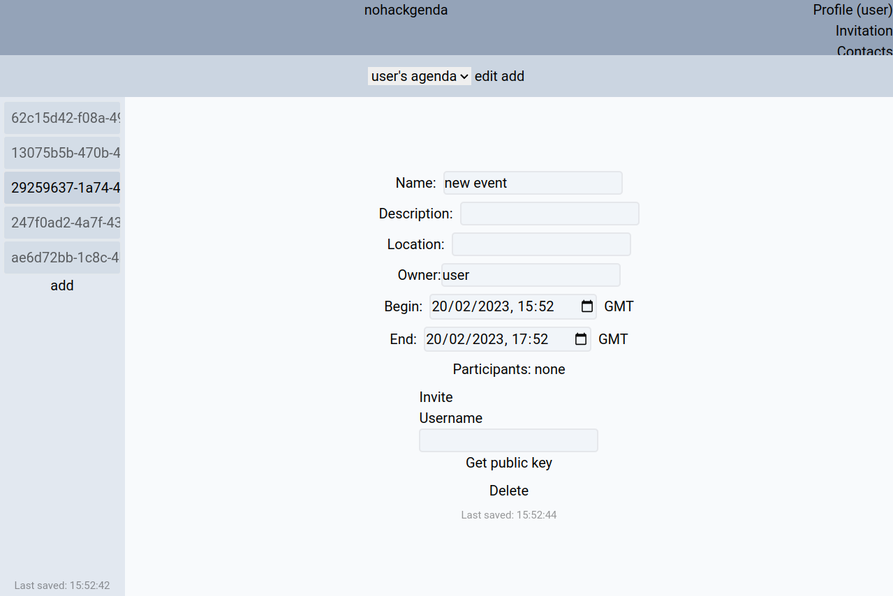
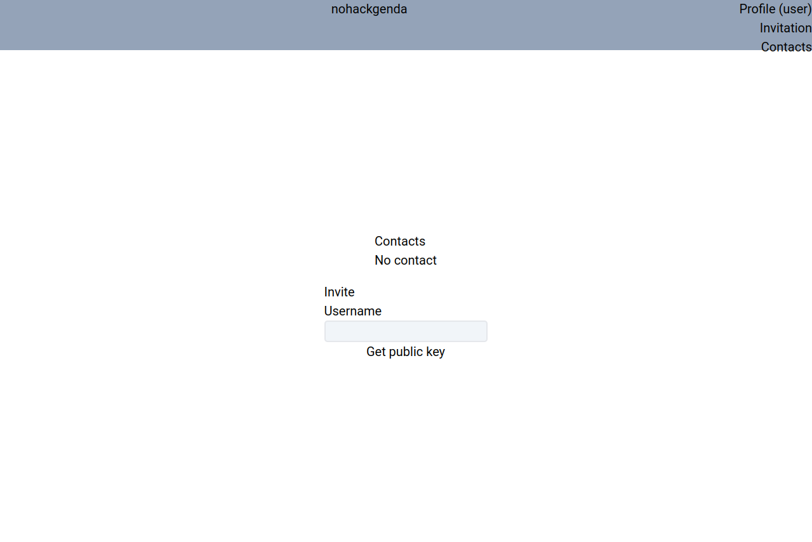
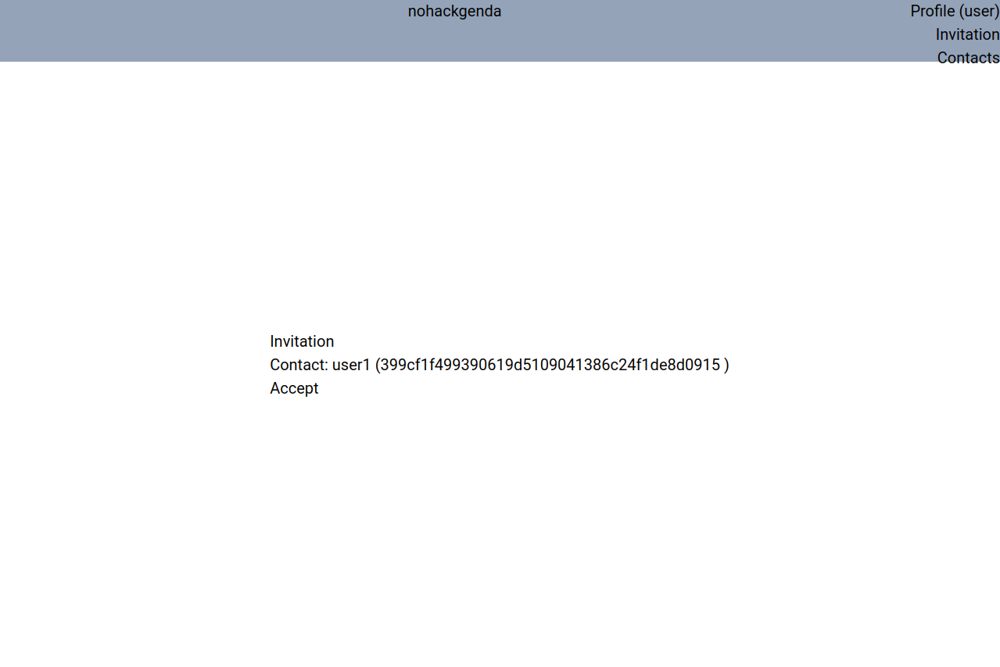
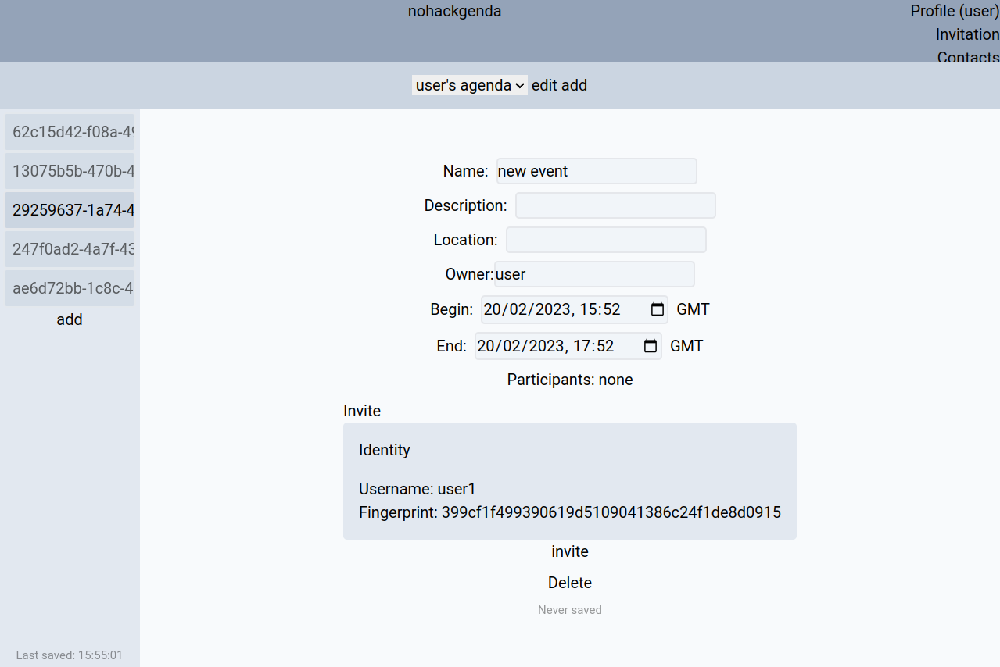

<h1 align="center">
    NoHackGenda
</h1>

<p align="center">
    Security focus online calendar.
</p>

<div align="center">
  
  
  
  
</div>

## How to use/setup our project <a name="setup"></a>

### 1) Clone the repository

### 2) Install Docker (if you already have it, skip this step)

[With this link](https://docs.docker.com/get-docker/)

### 3) Launch the container

```bash
$ docker compose -f "docker-compose.yml" up --build
```

### 4) Enjoy your secure agenda

Open your favorite browser and go to http://localhost:8080 or simply click [here](http://localhost:8080)

## Security features <a name="security_features"></a>

We have made a <a href="./report.pdf">report</a> that contains all the security features we have implemented.

# Authors

- **[etoome](https://github.com/etoome)**: developer
- **[maluyckx](https://gitlab.com/maluyckx)**: pentest, documentation
